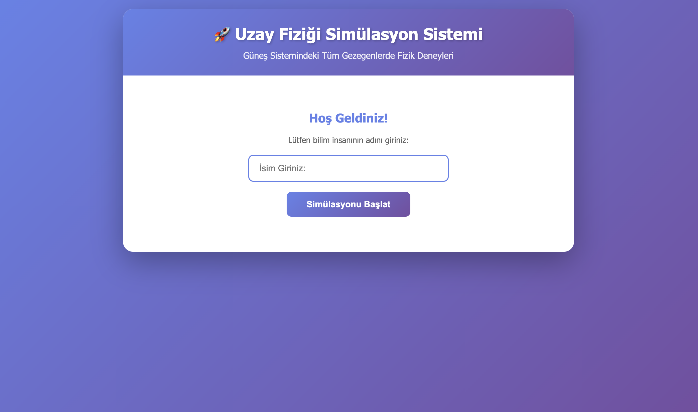
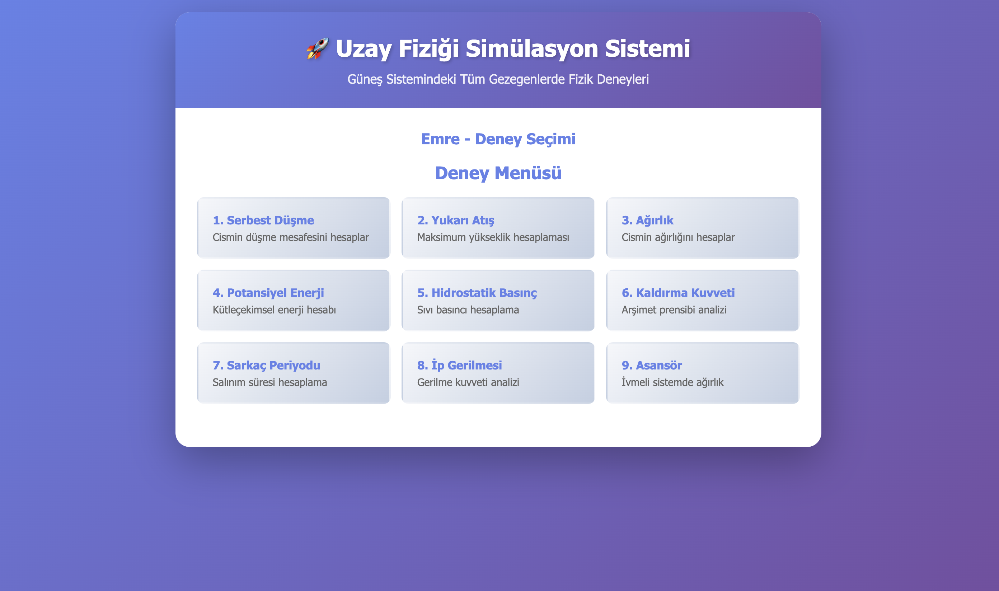
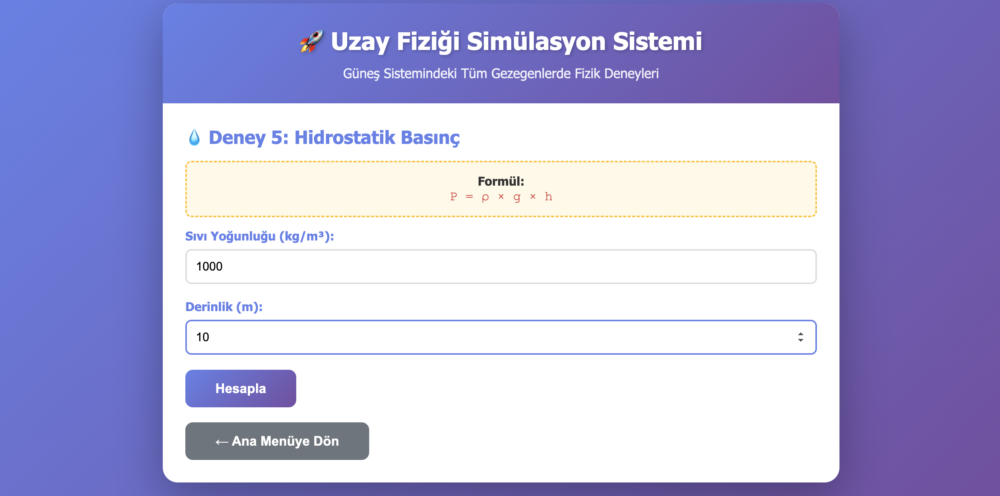
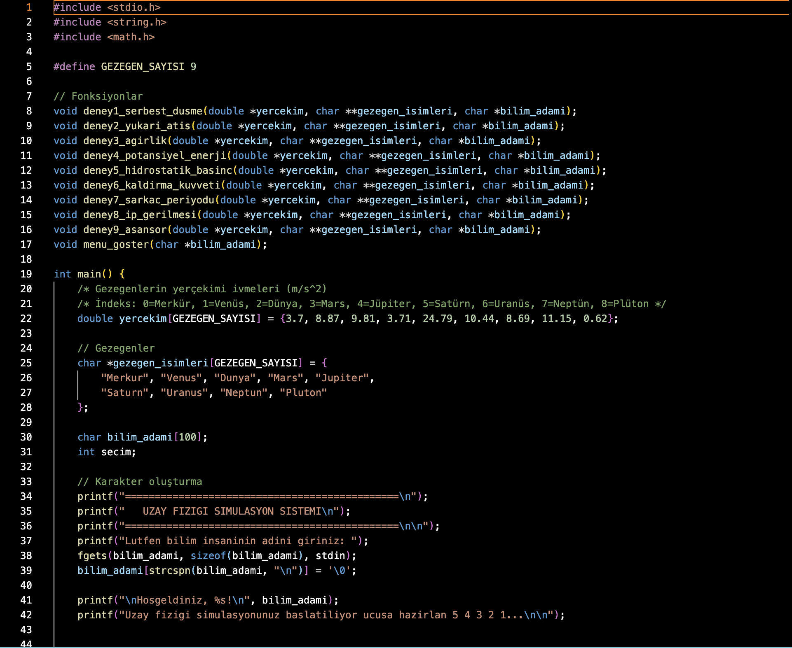
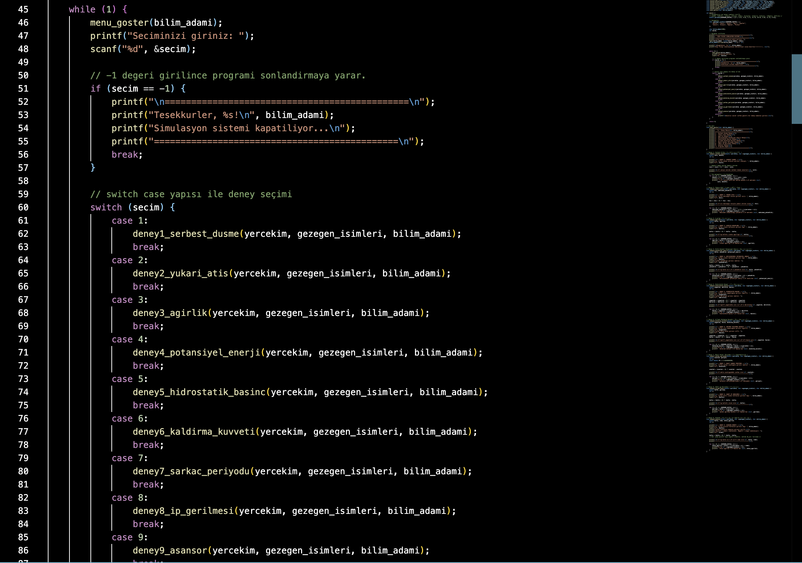
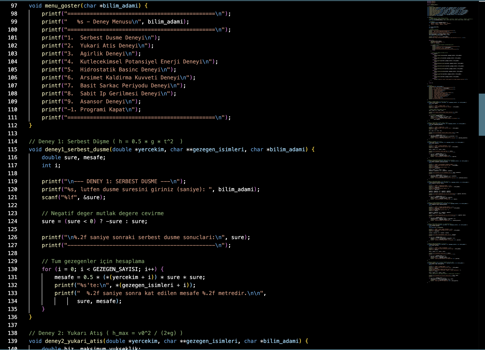

# 🚀 Uzay Fiziği Simülasyon Sistemi (C Versiyonu)

## 📋 Proje Hakkında

Bu proje, **Algoritmalar ve Programlama** dersi kapsamında geliştirilmiş **konsol tabanlı** bir uzay fiziği simülasyon uygulamasıdır. Program, tamamen **C dili** ile geliştirilmiştir ve Güneş Sistemindeki 9 farklı gezegen üzerinde fizik deneylerini simüle ederek, yerçekimi farklılıklarının fiziksel olaylara etkisini göstermektedir.

### 🎯 Proje Amacı

Bir bilim insanının farklı gezegenlerde fizik kurallarını test etmesini sağlayan interaktif bir simülasyon ortamı oluşturmak ve C programlama dilinde **pointer kullanımı**, **modüler programlama** ve **fizik hesaplamalarını** öğrenmek.

---

## 🎓 Akademik Bilgiler

**Ders**: Algoritmalar ve Programlama  
**Dönem**: 2025-2026 Güz  
**Kurum**: [Bursa Teknik Üniversitesi]  
**Bölüm**: Bilgisayar Mühendisliği  
**Öğrenci**: [Emre Karaömer]  
**Öğrenci No**: [22360859372]  

---

## ✨ Özellikler

### 🔬 9 Farklı Fizik Deneyi

| # | Deney Adı | Formül | Açıklama |
|---|-----------|--------|----------|
| 1 | Serbest Düşme | h = ½gt² | Cismin düşme mesafesini hesaplar |
| 2 | Yukarı Atış | h = v₀²/2g | Maksimum yükseklik hesaplaması |
| 3 | Ağırlık | G = mg | Cismin ağırlığını hesaplar |
| 4 | Potansiyel Enerji | Ep = mgh | Kütleçekimsel enerji hesabı |
| 5 | Hidrostatik Basınç | P = ρgh | Sıvı basıncı hesaplama |
| 6 | Kaldırma Kuvveti | Fk = ρgV | Arşimet prensibi analizi |
| 7 | Sarkaç Periyodu | T = 2π√(L/g) | Salınım süresi hesaplama |
| 8 | İp Gerilmesi | T = mg | Gerilme kuvveti analizi |
| 9 | Asansör | N = m(g±a) | İvmeli sistemde ağırlık |

### 🪐 Desteklenen Gezegenler

Program, Güneş Sistemindeki tüm gezegenlerde simülasyon yapar:

| Gezegen | Yerçekimi (m/s²) | Dizi İndeksi |
|---------|------------------|--------------|
| Merkür | 3.7 | 0 |
| Venüs | 8.87 | 1 |
| Dünya | 9.81 | 2 |
| Mars | 3.71 | 3 |
| Jüpiter | 24.79 | 4 |
| Satürn | 10.44 | 5 |
| Uranüs | 8.69 | 6 |
| Neptün | 11.15 | 7 |
| Plüton | 0.62 | 8 |

---

## 🛠️ Teknik Özellikler

### Kullanılan Teknolojiler
- **Programlama Dili**: C (ANSI C / C99)
- **Derleyici**: GCC 9.0+ veya Clang
- **Kütüphaneler**: 
  - `stdio.h` - Giriş/Çıkış işlemleri
  - `string.h` - String manipülasyonu
  - `math.h` - Matematiksel işlemler

### 🎯 Proje Gereksinimleri ve Karşılanma Durumu

| Gereksinim | Durum | Açıklama |
|------------|-------|----------|
| Konsol tabanlı | ✅ | Grafik arayüz yok, sadece terminal |
| C dili kullanımı | ✅ | %100 C ile yazılmış |
| Pointer tabanlı dizi erişimi | ✅ | `*(dizi + i)` formatı kullanılmış |
| Modüler fonksiyon yapısı | ✅ | Her deney ayrı fonksiyon |
| Girdi doğrulama (ternary) | ✅ | Negatif değerler için kullanılmış |
| 9 fizik deneyi | ✅ | Tüm deneyler implement edildi |
| Tüm gezegenlerde simülasyon | ✅ | 9 gezegen için hesaplama |
| Birim gösterimi | ✅ | Newton, Joule, Pascal vb. |
| -1 ile çıkış | ✅ | Menüden -1 ile program sonlanır |

### 🔑 Önemli Teknik Detaylar

#### ✅ 1. Pointer Kullanımı (Zorunlu Kural)

Proje gereksinimlerine göre **tüm dizi erişimleri pointer aritmetiği** ile yapılmıştır:

```c
// ❌ KULLANILMAYAN (Proje kurallarına aykırı):
double g = yercekim[i];
char* isim = gezegen_isimleri[i];

// ✅ KULLANILAN (Proje kurallarına uygun):
double g = *(yercekim + i);
char* isim = *(gezegen_isimleri + i);
```

**Kod Örneği:**
```c
// Serbest düşme hesaplaması - pointer kullanımı
for (i = 0; i < GEZEGEN_SAYISI; i++) {
    mesafe = 0.5 * (*(yercekim + i)) * sure * sure;
    printf("%s'te:\n", *(gezegen_isimleri + i));
    printf("  %.2f metre\n", mesafe);
}
```

#### ✅ 2. Ternary Operator ile Girdi Doğrulama (Zorunlu Kural)

Negatif değerler **if-else kullanılmadan** ternary operator ile mutlak değere çevrilir:

```c
// ❌ KULLANILMAYAN (Proje kurallarına aykırı):
if (kutle < 0) {
    kutle = -kutle;
}

// ✅ KULLANILAN (Proje kurallarına uygun):
kutle = (kutle < 0) ? -kutle : kutle;
```

**Kod Örneği:**
```c
double sure, kutle, yukseklik;

scanf("%lf", &sure);
sure = (sure < 0) ? -sure : sure;  // Negatif ise pozitife çevir

scanf("%lf", &kutle);
kutle = (kutle < 0) ? -kutle : kutle;

scanf("%lf", &yukseklik);
yukseklik = (yukseklik < 0) ? -yukseklik : yukseklik;
```

#### ✅ 3. Modüler Yapı

Her deney **ayrı bir fonksiyon** olarak implement edilmiştir:

```c
// Fonksiyon imzaları - pointer parametreler
void deney1_serbest_dusme(double *yercekim, char **gezegen_isimleri, char *bilim_insani);
void deney2_yukari_atis(double *yercekim, char **gezegen_isimleri, char *bilim_insani);
void deney3_agirlik(double *yercekim, char **gezegen_isimleri, char *bilim_insani);
// ... diğer deneyler
```

**Parametreler pointer olarak iletilir:**
- `double *yercekim` - Gezegen yerçekimi dizisi
- `char **gezegen_isimleri` - Gezegen isimleri dizisi
- `char *bilim_insani` - Bilim insanının adı


## 🎮 Kullanım Kılavuzu

### Program Akışı


Başlangıç
    ↓
[İsim Girişi] → Bilim insanının adı sorulur
    ↓
[Ana Menü] → 9 deney listelenir
    ↓
[Deney Seçimi] → Kullanıcı 1-9 arası seçim yapar
    ↓
[Parametre Girişi] → Deney için gerekli veriler istenir
    ↓
[Hesaplama] → Tüm gezegenler için hesaplanır
    ↓
[Sonuç Gösterimi] → Her gezegen için alt alta yazdırılır
    ↓
[Ana Menü] → Tekrar deney seçilebilir
    ↓
[-1 Girişi] → Program sonlanır


### Örnek Kullanım Senaryosu


==============================================
   UZAY FIZIGI SIMULASYON SISTEMI
==============================================

Lutfen bilim insaninin adini giriniz: X

Hosgeldiniz, X!
Simulasyon ortami baslatiliyor...

==============================================
   X - Deney Menusu
==============================================
1.  Serbest Dusme Deneyi
2.  Yukari Atis Deneyi
3.  Agirlik Deneyi
4.  Kutlecekimsel Potansiyel Enerji Deneyi
5.  Hidrostatik Basinc Deneyi
6.  Arsimet Kaldirma Kuvveti Deneyi
7.  Basit Sarkac Periyodu Deneyi
8.  Sabit Ip Gerilmesi Deneyi
9.  Asansor Deneyi
-1. Programi Kapat
==============================================
Seciminizi giriniz: 1

--- DENEY 1: SERBEST DUSME ---
X, lutfen dusme suresini giriniz (saniye): 5

5.00 saniye sonraki serbest dusme sonuclari:
----------------------------------------------
Merkur'te:
  5.00 saniye sonra kat edilen mesafe 46.25 metredir.

Venus'te:
  5.00 saniye sonra kat edilen mesafe 110.88 metredir.

Dunya'te:
  5.00 saniye sonra kat edilen mesafe 122.63 metredir.

Mars'te:
  5.00 saniye sonra kat edilen mesafe 46.38 metredir.

Jupiter'te:
  5.00 saniye sonra kat edilen mesafe 309.88 metredir.

Saturn'te:
  5.00 saniye sonra kat edilen mesafe 130.50 metredir.

Uranus'te:
  5.00 saniye sonra kat edilen mesafe 108.63 metredir.

Neptun'te:
  5.00 saniye sonra kat edilen mesafe 139.38 metredir.

Pluton'te:
  5.00 saniye sonra kat edilen mesafe 7.75 metredir.

==============================================
   x - Deney Menusu
==============================================
...
Seciminizi giriniz: -1

==============================================
Tesekkurler, X
Simulasyon sistemi kapatiliyor...
==============================================
```

---

## 📐 Fizik Formülleri ve Uygulamaları

### 1. Serbest Düşme Deneyi

**Formül:**
```
h = ½ × g × t²
```

**Değişkenler:**
- `h` : Düşme mesafesi (metre)
- `g` : Yerçekimi ivmesi (m/s²)
- `t` : Süre (saniye)

**Örnek Hesaplama:**
```
Dünya'da (g = 9.81 m/s²), 3 saniye düşen cisim:
h = 0.5 × 9.81 × 3²
h = 0.5 × 9.81 × 9
h = 44.145 metre
```

**Kod:**
```c
mesafe = 0.5 * (*(yercekim + i)) * sure * sure;
```

---

### 2. Yukarı Atış Deneyi

**Formül:**
```
h_max = v₀² / (2g)
```

**Değişkenler:**
- `h_max` : Maksimum yükseklik (metre)
- `v₀` : Başlangıç hızı (m/s)
- `g` : Yerçekimi ivmesi (m/s²)

**Örnek Hesaplama:**
```
20 m/s hızla Dünya'da yukarı atılan cisim:
h = 20² / (2 × 9.81)
h = 400 / 19.62
h ≈ 20.39 metre
```

**Kod:**
```c
maksimum_yukseklik = (hiz * hiz) / (2.0 * (*(yercekim + i)));
```

---

### 3. Ağırlık Deneyi

**Formül:**
```
G = m × g
```

**Değişkenler:**
- `G` : Ağırlık (Newton)
- `m` : Kütle (kg)
- `g` : Yerçekimi ivmesi (m/s²)

**Örnek Hesaplama:**
```
70 kg kişinin ağırlığı:
Dünya: G = 70 × 9.81 = 686.7 N
Mars: G = 70 × 3.71 = 259.7 N
Jüpiter: G = 70 × 24.79 = 1735.3 N
```

**Kod:**
```c
agirlik = kutle * (*(yercekim + i));
```

---

### 4. Kütleçekimsel Potansiyel Enerji

**Formül:**
```
Ep = m × g × h
```

**Değişkenler:**
- `Ep` : Potansiyel enerji (Joule)
- `m` : Kütle (kg)
- `g` : Yerçekimi ivmesi (m/s²)
- `h` : Yükseklik (metre)

**Örnek Hesaplama:**
```
10 kg cisim, 5 metre yükseklikte (Dünya):
Ep = 10 × 9.81 × 5
Ep = 490.5 Joule
```

**Kod:**
```c
potansiyel_enerji = kutle * (*(yercekim + i)) * yukseklik;
```

---

### 5. Hidrostatik Basınç

**Formül:**
```
P = ρ × g × h
```

**Değişkenler:**
- `P` : Basınç (Pascal)
- `ρ` : Sıvı yoğunluğu (kg/m³)
- `g` : Yerçekimi ivmesi (m/s²)
- `h` : Derinlik (metre)

**Örnek Hesaplama:**
```
Su (ρ = 1000 kg/m³), 10 m derinlikte (Dünya):
P = 1000 × 9.81 × 10
P = 98100 Pascal ≈ 98.1 kPa
```

**Kod:**
```c
basinc = yogunluk * (*(yercekim + i)) * derinlik;
```

---

### 6. Arşimet Kaldırma Kuvveti

**Formül:**
```
Fk = ρ × g × V
```

**Değişkenler:**
- `Fk` : Kaldırma kuvveti (Newton)
- `ρ` : Sıvı yoğunluğu (kg/m³)
- `g` : Yerçekimi ivmesi (m/s²)
- `V` : Batan hacim (m³)

**Örnek Hesaplama:**
```
0.5 m³ hacim, suda (ρ = 1000 kg/m³) - Dünya:
Fk = 1000 × 9.81 × 0.5
Fk = 4905 Newton
```

**Kod:**
```c
kaldirma_kuvveti = yogunluk * hacim * (*(yercekim + i));
```

---

### 7. Basit Sarkaç Periyodu

**Formül:**
```
T = 2π × √(L/g)
```

**Değişkenler:**
- `T` : Periyot (saniye)
- `L` : Sarkaç uzunluğu (metre)
- `g` : Yerçekimi ivmesi (m/s²)
- `π` : Pi sayısı (≈ 3.14159)

**Örnek Hesaplama:**
```
2 metre uzunluğunda sarkaç (Dünya):
T = 2 × π × √(2/9.81)
T = 2 × 3.14159 × √0.2039
T ≈ 2.84 saniye
```

**Kod:**
```c
periyot = 2.0 * PI * sqrt(uzunluk / (*(yercekim + i)));
```

---

### 8. Sabit İp Gerilmesi

**Formül:**
```
T = m × g
```

**Değişkenler:**
- `T` : Gerilme kuvveti (Newton)
- `m` : Asılı cismin kütlesi (kg)
- `g` : Yerçekimi ivmesi (m/s²)

**Örnek Hesaplama:**
```
5 kg cisim asılı (Dünya):
T = 5 × 9.81
T = 49.05 Newton
```

**Kod:**
```c
gerilme = kutle * (*(yercekim + i));
```

---

### 9. Asansör (Etkin Ağırlık)

**Formül:**
```
N = m × (g + a)    [yukarı ivmelenme veya aşağı yavaşlama]
N = m × (g - a)    [aşağı ivmelenme veya yukarı yavaşlama]
```

**Not:** Projede birleştirilmiş formül kullanılır: `N = m × (g + a)`
- Pozitif `a`: yukarı ivmelenme
- Negatif `a`: aşağı ivmelenme

**Değişkenler:**
- `N` : Etkin ağırlık (Newton)
- `m` : Kütle (kg)
- `g` : Yerçekimi ivmesi (m/s²)
- `a` : Asansör ivmesi (m/s²)

**Örnek Hesaplama:**
```
70 kg kişi, 2 m/s² yukarı ivmelenen asansörde (Dünya):
N = 70 × (9.81 + 2)
N = 70 × 11.81
N = 826.7 Newton

70 kg kişi, 2 m/s² aşağı ivmelenen asansörde (Dünya):
N = 70 × (9.81 - 2)
N = 70 × 7.81
N = 546.7 Newton
```

**Kod:**
```c
etkin_agirlik = kutle * ((*(yercekim + i)) + ivme);
```

---

## 📊 Birimler ve Standartlar

Tüm hesaplamalar **SI (Uluslararası Sistem) birimleri** kullanılarak yapılmıştır:

| Büyüklük | Birim | Sembol | Örnek Değer |
|----------|-------|--------|-------------|
| Kütle | Kilogram | kg | 70 kg |
| Uzunluk | Metre | m | 10 m |
| Zaman | Saniye | s | 5 s |
| Kuvvet | Newton | N | 686.7 N |
| Enerji | Joule | J | 490.5 J |
| Basınç | Pascal | Pa | 98100 Pa |
| Hız | Metre/Saniye | m/s | 20 m/s |
| İvme | Metre/Saniye² | m/s² | 9.81 m/s² |
| Yoğunluk | Kilogram/Metre³ | kg/m³ | 1000 kg/m³ |
| Hacim | Metre³ | m³ | 0.5 m³ |

---

## 🔍 Kod Yapısı

### Dosya Organizasyonu

```
uzay_simulasyonu.c
├── Kütüphane Dahilleri (#include)
├── Makrolar (#define)
├── Fonksiyon Prototipleri
├── main() Fonksiyonu
│   ├── Veri Tanımlamaları
│   ├── İsim Girişi
│   └── Ana Döngü (while)
│       ├── Menü Gösterimi
│       ├── Seçim İşleme
│       └── Deney Çağırma (switch-case)
└── Deney Fonksiyonları
    ├── deney1_serbest_dusme()
    ├── deney2_yukari_atis()
    ├── deney3_agirlik()
    ├── deney4_potansiyel_enerji()
    ├── deney5_hidrostatik_basinc()
    ├── deney6_kaldirma_kuvveti()
    ├── deney7_sarkac_periyodu()
    ├── deney8_ip_gerilmesi()
    └── deney9_asansor()
```

### Ana Veri Yapıları

```c
// Gezegen yerçekimi dizisi (double array)
double yercekim[GEZEGEN_SAYISI] = {
    3.7,    // Merkür
    8.87,   // Venüs
    9.81,   // Dünya
    3.71,   // Mars
    24.79,  // Jüpiter
    10.44,  // Satürn
    8.69,   // Uranüs
    11.15,  // Neptün
    0.62    // Plüton
};

// Gezegen isimleri dizisi (string array)
char *gezegen_isimleri[GEZEGEN_SAYISI] = {
    "Merkur", "Venus", "Dunya", "Mars", "Jupiter",
    "Saturn", "Uranus", "Neptun", "Pluton"
};

// Bilim adamı adı
char bilim_adami[100];
```

### Fonksiyon İmzaları

```c
// Menü gösterme
void menu_goster(char *bilim_insani);

// Deney fonksiyonları - hepsi aynı parametreleri alır
void deney1_serbest_dusme(
    double *yercekim,           // Yerçekimi dizisi pointer'ı
    char **gezegen_isimleri,    // İsim dizisi pointer'ı
    char *bilim_adami         // Bilim adamı adı
);

// Diğer 8 deney de aynı yapıda...
```

---

## ⚠️ Hata Yönetimi

### Girdi Doğrulama

Program, kullanıcı hatalarını şu şekilde yönetir:

#### 1. Negatif Değer Girişi
```c
// Otomatik düzeltme (ternary operator)
sure = (sure < 0) ? -sure : sure;
kutle = (kutle < 0) ? -kutle : kutle;
yukseklik = (yukseklik < 0) ? -yukseklik : yukseklik;
```

**Örnek:**
```c
Girdi: -5
Kullanılan: 5
```

#### 2. Geçersiz Menü Seçimi
```c
switch (secim) {
    case 1: ... break;
    case 2: ... break;
    // ...
    default:
        printf("\nGecersiz secim! Lutfen gecerli bir deney numarasi giriniz.\n\n");
}
```

**Örnek:**
```c
Seçim: 15
Çıktı: "Gecersiz secim! Lutfen gecerli bir deney numarasi giriniz."
```

#### 3. Program Sonlandırma
```c
if (secim == -1) {
    printf("Simulasyon sistemi kapatiliyor...\n");
    break;  // Döngüden çık
}

```
---

## 📸 Ekran Görüntüleri

### 1. Program Başlangıcı


### 2. Ana Menü


### 3. Deney Seçimi ve Giriş


### 4. Sonuç Ekranı


### 5. Kodlar
 
Her deney **ayrı bir fonksiyon** olarak implement edilip giriş karakter oluşturma kısmı tasarlanmıştır.




---

## 📚 Kaynakça

1. Serway, R. A., & Jewett, J. W. (2018). *Physics for Scientists and Engineers* (10th ed.). Cengage Learning.
